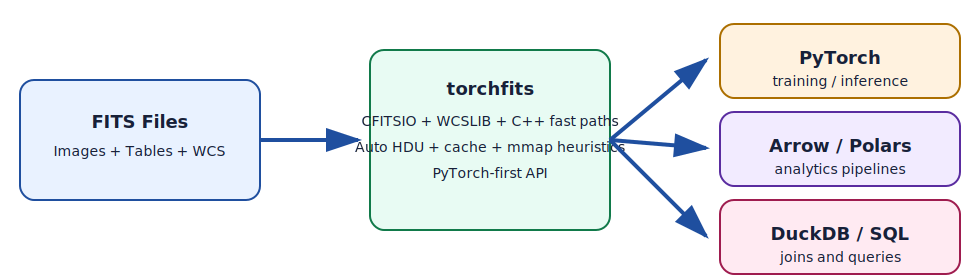

# torchfits

[](https://badge.fury.io/py/torchfits)
[](https://www.python.org/downloads/)
[](https://www.gnu.org/licenses/old-licenses/gpl-2.0.en.html)

High-performance FITS I/O for PyTorch.



## Install

```bash
pip install torchfits
```

For local source builds, prepare vendored native dependencies first:

```bash
./extern/vendor.sh
```

## Quick Start

```python
import torch
import torchfits

# Read image
img, header = torchfits.read("image.fits", return_header=True)

# Read table with projection + pushdown filter
table = torchfits.table.read(
    "catalog.fits",
    hdu=1,
    columns=["OBJID", "RA", "DEC"],
    where="DEC > 0"
)

# Stream large tables
for batch in torchfits.table.scan("catalog.fits", hdu=1, batch_size=100_000):
    ...

# In-place table mutation
torchfits.table.append_rows("catalog.fits", {"RA": [1.23], "DEC": [-0.42]}, hdu=1)
```

WCS convenience with payload HDU autodetection:

```python
wcs = torchfits.get_wcs("image_or_mef.fits", hdu="auto")
sky = wcs.pixel_to_world(torch.tensor([[0.0, 0.0]], dtype=torch.float64))
```

## Features

- FITS image I/O: full reads, subset reads, writes.
- FITS table I/O: projection, row slicing, row filtering, streaming.
- FITS table mutation: append/insert/delete/update rows and column edits.
- Interop: Arrow, Polars, DuckDB.

## Performance

- Optimized for repeated reads, compressed images, and ML data-loading workflows.
- 0.2.0 release benchmark snapshot shows torchfits ahead in 87/88 `read_full` cases vs `fitsio` and 87/88 vs `fitsio_torch` (details in `docs/benchmarks.md`).
- `benchmark_ml_loader.py` on CPU is near-parity and run-order/cache sensitive; current release run showed:
  - Uncompressed median: `0.985x` vs `fitsio`
  - Compressed median: `1.008x` vs `fitsio`
- Re-run on your target hardware: `pixi run python benchmarks/benchmark_ml_loader.py --device cpu`

## Documentation

- [API reference](docs/api.md)
- [Changelog](docs/changelog.md)
- [Examples guide](docs/examples.md)
- [Benchmarks guide](docs/benchmarks.md)
- [Contributing (dev/test/release)](docs/contributing.md)
- [Release runbook](docs/release.md)
- [Installation guide](docs/install.md)

## License

GPL-2.0.
