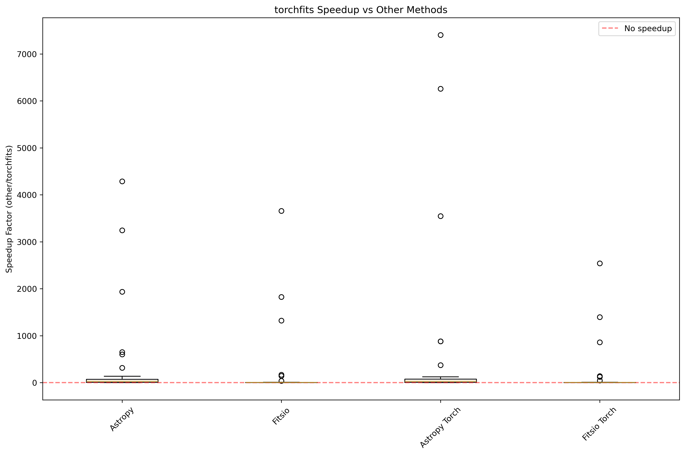

# torchfits

[](https://pypi.org/project/torchfits/)
[](https://github.com/sfabbro/torchfits/actions/workflows/build_wheels.yml)
[](https://github.com/sfabbro/torchfits/actions/workflows/ci.yml)

Fast FITS I/O for PyTorch image and table workflows.

## Install

```bash
pip install torchfits
```

## Quick Examples

Read an image directly as a tensor:

```python
import torchfits

image, header = torchfits.read("image.fits", return_header=True)
print(image.shape, image.dtype)
print(header["NAXIS"], header.get("OBJECT"))
```

Read a subset of a table and stream large catalogs:

```python
import torchfits

rows = torchfits.table.read(
    "catalog.fits",
    hdu=1,
    columns=["OBJID", "RA", "DEC"],
    where="DEC > 0",
)

for batch in torchfits.table.scan("catalog.fits", hdu=1, batch_size=100_000):
    # train / filter / export
    pass
```

WCS with payload-HDU autodetection:

```python
import torch
import torchfits

wcs = torchfits.get_wcs("image_or_mef.fits", hdu="auto")
sky = wcs.pixel_to_world(torch.tensor([[512.0, 512.0]], dtype=torch.float64))
```

## Performance Snapshot (v0.2.0)

- `read_full` exhaustive suite: wins in `87/88` cases vs `fitsio` (median `2.465x`) and `87/88` vs `fitsio_torch` (median `2.618x`).
- Astropy baselines: `88/88` wins vs both `astropy` and `astropy_torch`.
- ML loader benchmark (`benchmark_ml_loader.py`, CPU): near parity (`0.985x` uncompressed, `1.008x` compressed vs `fitsio` medians).



Full methodology and detailed tables: [`docs/benchmarks.md`](docs/benchmarks.md)

## Documentation

- User/API reference: [`docs/api.md`](docs/api.md)
- End-to-end examples: [`docs/examples.md`](docs/examples.md)
- Installation notes: [`docs/install.md`](docs/install.md)
- Changelog: [`docs/changelog.md`](docs/changelog.md)

## License

GPL-2.0
