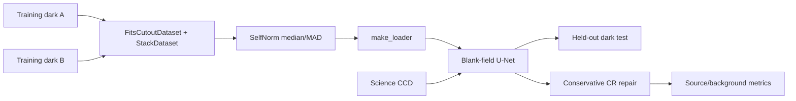

# Case Study: Conservative MegaCam Denoising with Noise2Noise

This case study is a small, runnable example of an end-to-end `torchfits` and
PyTorch workflow on real CFHT MegaCam multi-extension FITS files. It is not a
claim that a model trained only on dark frames can reconstruct arbitrary
astronomical scenes. The example makes that limitation explicit and uses the
model conservatively on science data.

The implementation is [`examples/example_megacam_cr_denoise.py`](published-examples/example_megacam_cr_denoise.py).

## What the example demonstrates

The pipeline uses:

1. `FitsCutoutDataset` to read coordinated patches from compressed calibration
   MEFs without converting them to another file format.
2. A custom `FITSTransform` that performs robust per-patch median/MAD
   normalization.
3. `StackDataset` and `make_loader` to create paired PyTorch batches.
4. A compact fully convolutional network trained with an L1 Noise2Noise loss.
5. Direct full-CCD reads, inference, metrics, JSON summaries, Markdown tables,
   and an optional before/after rendering.



## Why train on darks?

With the shutter closed, the intended astronomical image is a blank field.
The detector still contributes dark current, hot pixels, read noise, and
cosmic-ray events. Two exposures are therefore noisy observations of the same
blank-field geometry, with independent read noise and event locations. The
network is trained on paired patches from two different darks and learns a
detector-specific noise-to-blank prediction.

This is a useful calibration experiment, but it is not a clean ground truth
for a live astronomical field. In particular, a blank-field prediction must
not be written over a science exposure: that would remove stars, galaxies,
and diffuse structure along with the artifacts.

The default run uses the final dark file as a held-out test exposure. The
remaining darks are used for training; CCDs 31--40 within those training files
remain a separate convergence check. The held-out dark gives the model a real
exposure it never saw during optimization.

Biases can be used with `--mode bias` as a read-noise-only control. The default
`--mode both` runs both the dark and bias experiments when both sets are
available.

## The two inference policies

### Held-out dark: full blank-field prediction

A dark has a known blank astronomical field, so the network prediction is
used for the whole test CCD. Detector dark current means this is still a
calibration proxy rather than pixel-perfect ground truth. The generated
`dark_test_metrics.md` and `dark_summary.json` report:

- CR-like and sharp-outlier fractions before and after cleaning;
- median-centred dark RMS before and after cleaning; and
- the held-out file and HDU used for the test.

These are real dark-exposure measurements, not synthetic injected-noise
scores.

### Science: conservative isolated-pixel repair

For a science CCD the network is used as a second confidence check, not as a
replacement image. A pixel is repaired only when it satisfies both parts of
the conservative CR-like test:

1. it is more than `5 * robust_sigma` above a 7x7 box background; and
2. it is more than `5 * robust_sigma` above the median of its 3x3
   neighbourhood.

The neural blank prediction must also place the pixel more than `4 * MAD`
above the predicted blank level. Selected pixels are replaced by their local
3x3 median; all other science pixels are copied unchanged. This intentionally
favors source preservation over aggressive read-noise smoothing.

The science report measures the before/after CR-like fraction, sharp-outlier
fraction, faint-structure proxy, background median, and aperture flux ratios at
bright local maxima. There is no clean science target, so these metrics are
reported as diagnostics rather than as accuracy or PSNR.

The noise-injection probe adds a difference of two training darks to a science
window and checks how much the conservative path changes. It is a stress test,
not a substitute for a calibrated science reduction.

## Optional Astro-SCRAPPY comparison

Astro-SCRAPPY is a useful classical baseline for isolated cosmic-ray removal.
It is intentionally **not** a `torchfits` dependency. When the optional
package is available, pass `--compare-astroscrappy` to run it on the same
science and held-out-dark windows:

```bash
python examples/example_megacam_cr_denoise.py \
  --mode dark \
  --compare-astroscrappy
```

The script uses `sigclip=5`, `sigfrac=0.3`, `objlim=5`, four iterations, and a
robust read-noise estimate from each input window. The exact baseline outputs
are written to `astroscrappy_science_metrics.md` and
`astroscrappy_test_dark_metrics.md`, and are included in the dark summary JSON.
If Astro-SCRAPPY is not installed, the command prints a clear skip message and
the torchfits path still runs.

The comparison is deliberately on the same raw windows and uses the same
CR-like diagnostics. It does not imply that either method has identified every
cosmic-ray event: without a labeled science exposure, the mask is a proxy.

## Data and execution

The fetch scripts cache public CFHT files under
`benchmarks_data/cfht_megacam/`:

```bash
bash scripts/fetch_cfht_megacam_sample.sh
bash scripts/fetch_cfht_calib_frames.sh
python examples/example_megacam_cr_denoise.py \
  --mode both \
  --compare-astroscrappy
```

For a bounded smoke run, set `TORCHFITS_EXAMPLE_FAST=1`. It limits training to
one epoch, one CCD, and 1024x1024 evaluation windows while exercising the same
FITS dataset, transform, loader, inference, and reporting paths.

Useful options include:

```text
--mode {dark,bias,both}       Which calibration experiment to run
--eval-hdus N                 Number of HDUs per evaluation file
--full-eval-files N           Number of science files to inspect
--compare-astroscrappy       Run the optional classical baseline
--inject-stars                Add the synthetic flux-recovery appendix
--out-dir PATH                Directory for Markdown, JSON, and figures
```

The full run can take substantial time because a MegaCam MEF contains many
large CCD extensions. Use `--eval-hdus` and `--full-eval-files` to start with a
small, reproducible subset.

## Reading the rendering

The optional gallery image is a 512x512 crop selected because it contains the
largest number of CR-like pixels according to the diagnostic mask. It is **not**
a promised stellar cluster or a representative full-field photograph; a crop
from a sparse part of an exposure can look nearly empty. The figure is for
showing localized pixel changes, not for judging photometry.

Each panel is independently stretched between its 1st and 99th percentiles,
so the displayed brightness is not a calibrated comparison. For quantitative
interpretation, use the Markdown metrics and the aperture-flux/background
values in the JSON summary. A “cosmic ray removed” value means that a pixel
flagged by the before-image proxy is no longer flagged by the same proxy after
cleaning; it is not a count of visually obvious streaks and it is not a
supervised detection accuracy.

## Limitations

- Dark-to-blank training does not model the morphology or flux distribution of
  stars and galaxies.
- The science path repairs only isolated sharp positive excursions. It is not a
  general-purpose denoiser and does not promise to remove trails or extended
  artifacts.
- CR-like masks are heuristic because no clean version of the science frame is
  available.
- Astro-SCRAPPY and the neural path use different algorithms and should be
  compared with the reported source/background diagnostics, not with a single
  visual impression.

The main lesson is the FITS-native composition: calibration frames can feed a
PyTorch training loop directly, and the same `torchfits` reads can feed a
careful, measurable inference product without an intermediate image export.
