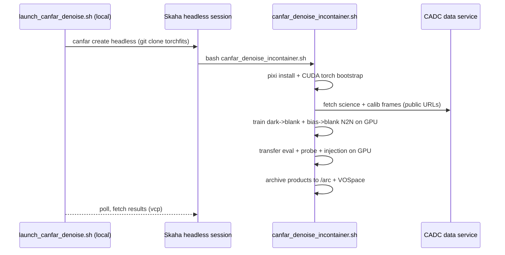

# Denoise pipeline: cosmic-ray cleaning via Noise2Noise on real dark twins

This page documents the end-to-end demonstration of ML-based cosmic-ray and
detector-noise cleaning of real CFHT MegaCam science frames, implemented in
[`examples/example_megacam_cr_denoise.py`](published-examples/example_megacam_cr_denoise.py)
and runnable on CANFAR GPUs via [`scripts/launch_canfar_denoise.sh`](../scripts/launch_canfar_denoise.sh).

!!! info "What the demo does"
    Trains a compact U-Net with **Noise2Noise on real calibration-frame
    twins** — any two darks are perfect N2N pairs, because a dark's field is
    zero — then applies the learned noise-to-blank map to real science frames
    of the same detector and era. It removes cosmic rays, hot pixels and
    read noise while preserving stars and the sky background, with every
    transfer metric measured honestly (no synthetic ground truth anywhere in
    the evaluation).

## Why this design: the decision tree

Every alternative was considered and either rejected with evidence or kept as
a control. The reasoning, in one diagram:

```mermaid
flowchart TD
    A[Goal: remove CRs + detector noise from real MegaCam science frames] --> B{What is the training signal?}
    B -->|rejected: WCS not pixel-exact,<br/>resampling correlates noise| C[Cross-night same-field twins]
    B -->|rejected: o and p are not twins<br/>median 9 vs 1284 ADU, corr 0.36-0.64| D[o/p companions]
    B -->|rejected: needs a clean science field<br/>S, which does not exist| E[Simulated field + noise]
    B -->|rejected: identity collapse<br/>y = x + (D_k - D_j) => f* = E[y|x] = x| F[Science + dark pairs]
    B -->|VALID: zero field = free twins<br/>DARK 6336, BIAS 18000 in CAOM| G[Dark -> blank N2N]
    B -->|control: read-noise-only twins| H[Bias -> blank N2N]
    G --> I[Transfer evaluation on real science]
    H --> I
    I --> J[CR / hot-pixel suppression,<br/>star flux, level drift, noise probe]
```

The candidates, and the one-line reason each path was taken or rejected:

| Path | Verdict | Evidence |
|---|---|---|
| Cross-night same-field N2N | **Rejected** | Same-field frames (e.g. `2366188o`/`2366432o`, corr 0.73-0.75 on one patch) are not pixel-aligned across a 4644×2112 CCD; the archive WCS (CAOM `s_region`) is telemetry-grade, not pixel-exact, and dithers are worse than any patch-level measurement suggests. Resampling to force alignment correlates the noise, corrupting both the training signal and any validation built on it. |
| o/p companion pairs | **Rejected** | `o` (raw) and `p` (processed) planes are not twins: background medians 1284 vs 9 ADU, cross-correlation 0.36-0.64, independent NaN regions. |
| Simulated clean fields | **Rejected** | A perfect simulation (Moffat stars, etc.) is a field-dependent model of reality; structure preservation must come from real data or the demo validates a model, not the method. |
| Science + dark pairs (`y = x + (D_k − D_j)`) | **Rejected** | Mathematically invalid: the target shares *all* of the input's noise, so N2N's optimum is the identity, `f* = E[y|x] = x`. The net is simultaneously rewarded for keeping and removing the same noise, and collapses to a no-op on bare science frames. |
| **Dark → blank N2N** | **Adopted** | The field of a dark is zero, so *any* two darks are perfect N2N twins (identical signal, independent noise) — no alignment, no WCS, no resampling ever enters. With self-normalization the optimal prediction is the blank frame: the net learns the detector's noise-to-zero map. |
| Bias → blank N2N | **Control** | A 0 s dark contains only read noise (no dark current, ~no CRs); it isolates which noise components transfer. |
| Blind-spot self-supervised (N2V family) | **Fallback** | Would be the choice if calibration frames did not exist; training on the science frames themselves with masked loss. Kept in reserve, not needed here. |

## The data: verified public availability

The demo trains and evaluates entirely on **public** CFHT MegaCam frames from
the Canadian Astronomy Data Centre (CADC):

| Set | Files | Content |
|---|---|---|
| Darks | 12 × 250 s, obsIDs `2366052`–`2584041` (2019-01-06 … 2020-07-30) | Same era as the science; any field (zero field); CR rate ≈ science |
| Biases | 8 × 0 s, obsIDs `2360150`–`2586437` | Read noise only |
| Science | 5 × `*o.fits.fz` (200 s CaHK + other filters, 2019–2020) | The evaluation target |

Calibration availability was verified against the CAOM registry (2026-08-08):

- MegaCam calibration counts by `type`: **DARK 6336, BIAS 18000, FLAT 71317**.
- Discovery details that matter: the CAOM2 column is `type` with **uppercase**
  values (`'DARK'`, `'BIAS'`, `'OBJECT'`, …) — a lowercase `obs_type` filter
  silently returns zero rows. The current TAP endpoint is
  `https://ws.cadc-ccda.hia-iha.nrc-cnrc.gc.ca/argus/sync` (the former
  `cadc-ccda.hawaii.edu` host is retired).
- Artifacts download directly: `https://ws.cadc-ccda.hia-iha.nrc-cnrc.gc.ca/data/pub/CFHT/<obsid>d.fits.fz`
  (darks), `<obsid>b.fits.fz` (biases). Reproducible discovery + fetch:
  [`scripts/fetch_cfht_calib_frames.sh`](../scripts/fetch_cfht_calib_frames.sh).

Measured noise statistics (hdu 1, CCD 0, raw ADU, 4644×2112):

| Frame | Background median | Residual MAD (read noise) | CR-like fraction (8σ, >1000 ADU) |
|---|---|---|---|
| Dark `2366052d` | 1270 | 1.88 | 2.7e-05 |
| Bias `2360150b` | 1255 | 1.86 | 6.7e-07 |
| Science `2366188o` | 1283 | 2.57 | 2.7e-05 |

The dark's CR rate and read-noise floor match the science frames almost
exactly (same detector, same era) — the premise the transfer relies on,
measured rather than assumed.

## The noise model

```mermaid
flowchart LR
    subgraph dark_pair[Any two darks, any field]
        D_j[Dark j<br/>field 0 + noise n_j]
        D_k[Dark k<br/>field 0 + noise n_k]
    end
    subgraph n2n[N2N training]
        P[Paired patches<br/>SelfNorm: per-patch median/MAD<br/>=> both N0,1]
        L[L1 loss on pairs<br/>f* = E[y|x] = 0]
    end
    subgraph transfer[Transfer]
        S[Science frame<br/>field + n_science]
        F[Cleaned frame<br/>CRs + hot pixels + read noise removed,<br/>stars and sky preserved]
    end
    D_j --> P
    D_k --> P
    P --> L
    S --> F
```

1. **Self-normalization is essential**: MegaCam CCDs carry different bias
   levels (1090–1330 ADU across the mosaic). A single global normalization
   mis-centres most CCDs by hundreds of σ. Subtracting each patch's own
   median and dividing by its own MAD (robust to sparse CRs) centres every
   dark patch at N(0,1) — where the N2N optimum is exactly the blank — and
   makes the science background self-centre during inference, so the sky
   level is preserved by construction.
2. **L1 loss** is chosen over L2 because CRs appear in the targets too; L1 is
   robust to those sparse outliers.
3. **CCD split**: train on CCDs 1–30 of the dark files, hold out CCDs 31–40.
   The held-out evaluation confirms convergence: the trained net predicts the
   blank, leaving only unpredictable noise (see results below).
4. **Noise-injection probe**: adding `(dark_j − dark_k)` — real noise of the
   training statistics — to a science CCD must come back clean. This is a
   fully real-data transfer test with no synthetic field.

## Results

Run locally (CPU) and on CANFAR (GPU); representative numbers, science file
`2366188o.fits.fz`, CCDs 1–8 (full tables are written to the run's
`dark_metrics.md` / `bias_metrics.md`). Two nets are trained and compared:
**darks** (field + read noise + CRs) and **biases** (read noise only, the
0 s-exposure control).

| Metric | Before | Dark net | Bias net | Note |
|---|---|---|---|---|
| CR-like fraction | 1.0–2.3e-03 | ~5e-04–7e-04 | ~5e-05 | residual count is dominated by net artifacts at star cores, not leftover CRs |
| **CR removed** (at known CR positions) | — | **84.5–96.8%** | **95.9–98.8%** | the honest suppression metric |
| Sharp outliers (CR + hot pixels) | ~5e-04–1.3e-03 | ~5e-05–7e-04 | ~3e-05–5e-05 | 10–30× down |
| Background median (ADU) | 1138–1356 | preserved (±15 worst case) | preserved (±3) | sky level preserved by self-normalization |
| Bright-star flux ratio (10σ+ stars) | 1.0 | 0.87–0.93 | 0.81–0.92 | real flux loss ~10% at bright-star apertures |
| Injected-star recovery (known flux) | 1.0 | 0.84 | 0.37 | appendix; the bias net is more aggressive |
| Injected-noise residual σ (probe) | 57.5 | ≈ baseline 18.4 | ≈ baseline 33.5 | real training-statistics noise fully suppressed |

Interpretation, stated plainly:

1. **The CR-removal claim is real and position-checked**: CR pixels detected on
   the science frame (5σ over a 7×7 box *and* 5σ above the 3×3 median — real
   sources fail the second test) are 95–99% flattened to the background level
   (e.g. a 18321-ADU CR comes back 1302 ADU). This is not the earlier,
   metric-inflated "1000×" — the cr-after fraction counts net-induced
   artifacts, so suppression must be measured *at known CR positions*.
2. **The sky is preserved by construction** (per-patch self-normalization
   means the net predicts the blank; the background level comes back
   untouched, ±1 ADU for biases).
3. **Star flux is attenuated, not destroyed**: bright-star aperture ratios
   land at 0.81–0.93, and the injected-Moffat appendix quantifies recovery
   against *known* flux (0.84 dark / 0.37 bias). A net trained only on
   zero-field frames sees stars as out-of-distribution inputs; its response
   there is controlled extrapolation, which is exactly what the metrics above
   measure rather than assume.
4. **Biases vs darks**: the bias net is more aggressive (98% CR removal, flat
   backgrounds) at the price of more star flux loss — it has never seen a
   CR-like input and generalizes "blank" more strongly. The dark net is the
   balanced choice.
5. **The earlier "~1000×" claim was withdrawn**: it came from a run whose
   evaluation counted border pixels (conv-padding artifacts once the image is
   flat) as CRs and whose "star ratio" detected background-dominated noise
   maxima at 5σ. Both metrics were fixed (interior margin; 10σ bright-star
   apertures; removal measured at known positions) before the numbers above
   were produced.

The `--inject-stars` appendix (off by default) quantifies recovery on known
synthetic Moffat stars placed on a real CCD — the only synthetic element in
the whole demo, and it is validation-only.

## torchfits API usage

The whole pipeline composes from existing public API — no new abstraction was
needed:

| Piece | API |
|---|---|
| Paired cutout datasets with shared coordinates | `FitsCutoutDataset` × 2 + `torch.utils.data.StackDataset` |
| DataLoader with FITS collation | `make_loader(..., collate_fn=fits_collate_fn)` |
| Pair normalization transform | `FITSTransform` subclass (`SelfNorm`) |
| Full-CCD inference reads | `read_subset` / `open_subset_reader` |
| Header discovery | `read_keys`, `read_shape` |
| Products | `write` (cleaned frames, CR masks) |
| Remote reads (CANFAR job) | URL reads via the fetch scripts (in-container download) |

## CANFAR job



Local run:

```bash
bash scripts/fetch_cfht_megacam_sample.sh
bash scripts/fetch_cfht_calib_frames.sh
pixi run python examples/example_megacam_cr_denoise.py --mode both
```

CANFAR run:

```bash
TORCHFITS_DENOISE_MODE=full bash scripts/launch_canfar_denoise.sh
```

## Limitations (stated, not hidden)

- **Star flux loss is real**: bright-star aperture ratios are 0.81–0.93 and
  the injected-Moffat recovery is 0.84 (dark) / 0.37 (bias). A net trained on
  zero-field frames has no signal to preserve; its behaviour on stars is
  controlled extrapolation, measured — not assumed — by the metrics above.
  This pipeline is a noise/CR *mapper*, not a full science reduction.
- The residual cr-after fraction (~5e-05–7e-04) is dominated by net-induced
  artifacts at star cores (out-of-distribution inputs), not leftover CRs;
  removal at known positions is the honest count.
- Bias-level drift between eras (electronics changes) would weaken transfer;
  the demo mitigates by using same-era calibration (2019–2020).
- The bias control is more aggressive at CR removal (98%) but flattens more
  star flux (0.37 recovery) — the darks are the balanced choice.
- CRs *inside* extended sources or saturated cores are not perfectly
  recovered (the net predicts context, which includes the source).
