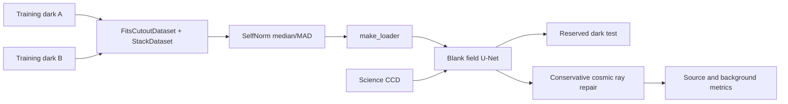

# Case Study: Conservative MegaCam Denoising with Noise2Noise

This page walks through a runnable example that trains a small neural network
on CFHT MegaCam calibration darks and then applies it carefully to science
data. The model is trained only on darks, so it cannot reconstruct arbitrary
scenes. The example keeps that boundary explicit and uses the model in a way
that preserves sources.

The implementation is
[`examples/example_megacam_cr_denoise.py`](published-examples/example_megacam_cr_denoise.py).

## What the example demonstrates

The pipeline uses:

1. `FitsCutoutDataset` to read matching patches from compressed calibration
   files without converting them to another format.
2. A custom `FITSTransform` that normalizes each patch by its own median and
   median absolute deviation.
3. `StackDataset` and `make_loader` to build paired PyTorch batches.
4. A compact, fully convolutional network trained with an L1 Noise2Noise loss.
5. Reading of whole CCDs, inference, metrics, JSON summaries, Markdown tables,
   and an optional figure showing each window before and after.



## Why train on darks?

With the shutter closed, the intended image is blank. The detector still adds
dark current, hot pixels, read noise, and cosmic ray hits. Two darks are
therefore noisy observations of the same empty field, with independent read
noise and independent hit positions. The example trains on paired patches from
two different darks, which teaches the network to predict blank for a given
detector.

That training is a useful calibration exercise. A dark does not give a clean
image of a live field, so the example never writes the blank prediction over
science data; doing so would erase stars, galaxies, and diffuse structure along
with the artifacts.

By default the last dark file is set aside as a test exposure. The remaining
darks train the model, and CCDs 31 through 40 of those training files serve as
a separate convergence check. The reserved dark gives the model a real exposure
it never saw during optimization.

Biases provide a read noise control through `--mode bias`. The default
`--mode both` runs the dark and bias experiments together when both sets are
present.

## The two inference policies

### Reserved dark: predict the blank field

A dark really is a blank field, so the network prediction is used for the whole
test CCD. Dark current means the prediction remains a calibration proxy rather
than pixel-perfect truth. The generated `dark_test_metrics.md` and
`dark_summary.json` report:

- the cosmic ray and sharp outlier fractions before and after cleaning;
- the dark RMS about the median before and after cleaning; and
- the file and HDU used for the test.

These numbers come from a real dark exposure rather than synthetic injections.

### Science: conservative repair of isolated pixels

For a science CCD the network acts as a second opinion alongside the image
itself. A pixel is repaired only when it passes both parts of the cosmic ray
test:

1. it lies more than `5 * robust_sigma` above a 7x7 box background; and
2. it lies more than `5 * robust_sigma` above the median of its 3x3
   neighbourhood.

The blank prediction must also place the pixel more than `4 * MAD` above the
predicted blank level. Pixels that pass are replaced by their local 3x3 median;
every other science pixel is copied unchanged. This favours keeping sources
over aggressive smoothing of read noise.

The science report measures the cosmic ray and sharp outlier fractions before
and after cleaning, a count of faint structure, the background median, and
aperture flux ratios at bright local maxima. Because no clean science target
exists, these values are reported as diagnostics rather than accuracy scores.

The noise injection probe adds the difference of two training darks to a
science window and measures how much the conservative path changes. It provides
a stress test of that path.

## Optional Astro-SCRAPPY comparison

Astro-SCRAPPY is a classical baseline for removing isolated cosmic rays. It is
an optional extra, installed separately from `torchfits`. When it is available,
pass `--compare-astroscrappy` to run it on the same science and reserved dark
windows:

```bash
python examples/example_megacam_cr_denoise.py \
  --mode dark \
  --compare-astroscrappy
```

The script calls it with `sigclip=5`, `sigfrac=0.3`, `objlim=5`, four
iterations, and a robust read noise estimate for each window. The baseline
output lands in `astroscrappy_science_metrics.md` and
`astroscrappy_test_dark_metrics.md`, and also appears in the dark summary JSON.
If Astro-SCRAPPY is missing, the command prints a short skip message and the
torchfits path still runs.

The comparison uses the same raw windows and the same cosmic ray diagnostics
for both methods. Neither method can claim to have found every cosmic ray,
because no labelled science exposure exists; the mask is a proxy in both cases.

## Data and execution

The fetch scripts cache public CFHT files under
`benchmarks_data/cfht_megacam/`:

```bash
bash scripts/fetch_cfht_megacam_sample.sh
bash scripts/fetch_cfht_calib_frames.sh
python examples/example_megacam_cr_denoise.py \
  --mode both \
  --compare-astroscrappy
```

Set `TORCHFITS_EXAMPLE_FAST=1` for a bounded run that trains one epoch,
evaluates a single CCD, and uses 1024x1024 windows. It still exercises the
dataset, transform, loader, inference, and reporting paths.

Useful options:

```text
--mode {dark,bias,both}       Which calibration experiment to run
--eval-hdus N                 Number of HDUs per evaluation file
--full-eval-files N           Number of science files to inspect
--compare-astroscrappy       Run the optional classical baseline
--inject-stars                Add the synthetic flux recovery appendix
--out-dir PATH                Directory for Markdown, JSON, and figures
```

A MegaCam file holds many large CCD extensions, so the full run takes a while.
Start with `--eval-hdus` and `--full-eval-files` to keep a first run short and
reproducible.

## Reading the figure

The optional gallery image is a 512x512 crop chosen because it has the most
cosmic ray candidates under the diagnostic mask. It is a focused patch, so a
sparse region can look nearly empty. The figure shows localized pixel changes
rather than overall photometry.

Each panel is stretched independently between its 1st and 99th percentiles, so
the on-screen brightness has no calibrated meaning. For quantitative
interpretation, use the Markdown metrics and the aperture flux and background
values in the JSON summary. The "cosmic ray removed" value counts pixels that
the before image proxy flagged and that the same proxy no longer flags after
cleaning; it measures a change in that proxy rather than supervised detection
accuracy.

## Limitations

- Training on darks teaches nothing about the morphology or flux distribution
  of stars and galaxies.
- The science path repairs isolated, sharp positive excursions only. Trails
  and extended artifacts remain in place.
- The cosmic ray masks are heuristic, because no clean version of the science
  frame is available.
- Astro-SCRAPPY and the neural path use different algorithms; compare them with
  the source and background diagnostics rather than a single visual impression.

The main lesson is how the pieces compose: calibration frames feed a PyTorch
training loop directly, and the same `torchfits` reads feed a careful,
measurable inference result without exporting images in between.
