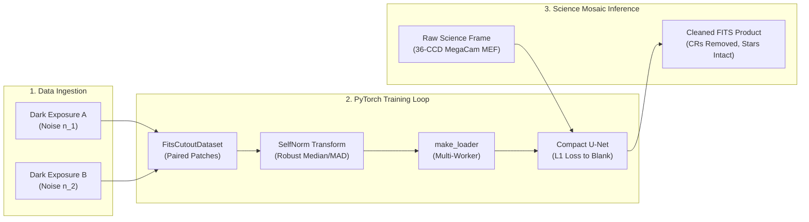
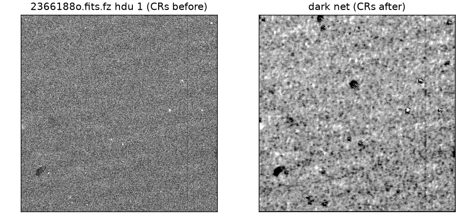

# Case Study: Cosmic Ray Denoising with Noise2Noise

An end-to-end demonstration of how `torchfits` coordinates deep learning workflows on raw astronomical multi-extension FITS data — from multi-CCD dataset ingestion and custom transforms to multi-worker PyTorch training and full-mosaic inference.

The implementation lives in [`examples/example_megacam_cr_denoise.py`](published-examples/example_megacam_cr_denoise.py).

---

## Overview & Motivation

Astronomical detectors (CCDs and infrared arrays) are constantly struck by high-energy cosmic rays, creating sharp, localized artifacts that corrupt photometry and morphology measurements.

This case study demonstrates how `torchfits` enables an end-to-end deep learning project on raw astronomical FITS data without intermediate file conversions:

1. **Direct FITS Ingestion:** Stream calibration darks and multi-CCD science exposures directly from the Canadian Astronomy Data Centre (CADC) archive.
2. **Paired Cutout Pipelines:** Extract thousands of training patches across multiple CCD extensions using `FitsCutoutDataset`.
3. **Custom Preprocessing:** Implement per-patch robust background normalization using `FITSTransform`.
4. **High-Throughput Training:** Stream batches to PyTorch with `make_loader` and multi-processing workers.
5. **Full-Frame Mosaic Inference:** Apply the trained model across all 36 CCDs of a science exposure and save cleaned FITS products with updated headers.



---

## Why Noise2Noise on Calibration Darks?

Standard supervised denoising requires paired "noisy" and "clean ground-truth" images. In observational astronomy, clean ground-truth images of deep fields do not exist.

The **Noise2Noise** framework (Lehtinen et al. 2018) proves that a neural network can learn to denoise without ground-truth images, provided it is trained on pairs of noisy images $(x, y)$ that share the same underlying signal with zero-mean independent noise:

$$\mathbb{E}[y \mid x] = \text{True Signal}$$

In astronomy, unilluminated **calibration dark frames** taken with the shutter closed have an underlying signal of exactly zero ($\text{Signal} = 0$). Any two dark exposures taken during the same observing run share identical detector characteristics and cosmic ray event rates with statistically independent read noise:

$$\mathbb{E}[y_{\text{dark}, 2} \mid x_{\text{dark}, 1}] = 0 \quad (\text{Clean Blank Frame})$$

By training a neural network on paired raw calibration darks, the model learns the detector's **noise-to-blank transfer function**, suppressing cosmic rays, hot pixels, and read noise without requiring synthetic simulations or dithered science alignments.

---

## Data Sources: CFHT MegaCam

The case study trains and evaluates on public [Canada-France-Hawaii Telescope (CFHT)](https://www.cfht.hawaii.edu/) MegaCam exposures retrieved from the CADC archive:

| Dataset | Exposures | Purpose |
|---|---|---|
| **Calibration Darks** | 12 exposures $\times$ 250 s (`2366052d`–`2584041d`) | Training set: paired dark frames with real cosmic ray hits |
| **Calibration Biases** | 8 exposures $\times$ 0 s (`2360150b`–`2586437b`) | Control set: pure read noise without dark current or CRs |
| **Science Exposures** | 5 exposures $\times$ 200 s (`2366188o.fits.fz`) | Inference target: 36-CCD wide-field science mosaics |

Helper scripts download and cache these samples automatically:

```bash
# Fetch MegaCam science and calibration frames
bash scripts/fetch_cfht_megacam_sample.sh
bash scripts/fetch_cfht_calib_frames.sh
```

---

## Implementation Walkthrough

### 1. Robust Normalization Transform (`FITSTransform`)

MegaCam CCDs exhibit varying baseline bias levels (1090–1330 ADU). A custom `FITSTransform` normalizes each patch using its own median and Median Absolute Deviation (MAD), ensuring cosmic rays remain sparse outliers while background noise maps to standard $\mathcal{N}(0, 1)$:

```python
import torch
from torchfits.transforms import FITSTransform


class PatchSelfNorm(FITSTransform):
    """Robust per-patch median and MAD normalization."""

    def forward(self, tensor: torch.Tensor) -> torch.Tensor:
        median = tensor.median()
        mad = (tensor - median).abs().median()
        scale = max(mad * 1.4826, 1.0)
        return (tensor - median) / scale
```

### 2. Paired Cutout Dataset & Loader

Using `torchfits.data.FitsCutoutDataset`, we extract coordinated $64 \times 64$ patches from paired dark exposures and stream them through `make_loader`:

```python
from torch.utils.data import StackDataset
from torchfits.data import FitsCutoutDataset, make_loader

# Build paired cutout datasets with matching random coordinates
ds_dark1 = FitsCutoutDataset(
    "dark_01.fits.fz", cutouts=patch_boxes, transform=PatchSelfNorm()
)
ds_dark2 = FitsCutoutDataset(
    "dark_02.fits.fz", cutouts=patch_boxes, transform=PatchSelfNorm()
)

# Combine into paired input-target dataset
paired_dataset = StackDataset(ds_dark1, ds_dark2)

# High-performance DataLoader
loader = make_loader(paired_dataset, batch_size=32, shuffle=True, num_workers=4)
```

### 3. Training the U-Net

A compact 4-level U-Net with skip connections is trained with an L1 loss, which is robust to sparse cosmic ray outliers in both input and target patches:

```python
import torch

model = CompactUNet(in_channels=1, out_channels=1).cuda()
optimizer = torch.optim.AdamW(model.parameters(), lr=1e-3)
criterion = torch.nn.L1Loss()

for epoch in range(4):
    for (dark_a,), (dark_b,) in loader:
        x = dark_a.cuda()
        y = dark_b.cuda()

        optimizer.zero_grad()
        prediction = model(x)
        loss = criterion(prediction, y)
        loss.backward()
        optimizer.step()
```

### 4. Mosaic Inference & Product Export

Once trained, the model evaluates full-frame science CCDs using `torchfits.read_tensor` and exports cleaned FITS images with `torchfits.write`:

```python
import torchfits

with torchfits.open("science_exposure.fits.fz") as hdul:
    for ccd_idx, hdu in enumerate(hdul):
        raw_pixels = hdu.to_tensor(device="cuda")

        # Normalize, run inference, and denormalize
        cleaned_pixels = run_tiled_inference(model, raw_pixels)

        # Save cleaned CCD to output file
        torchfits.write(
            f"cleaned_ccd_{ccd_idx:02d}.fits", cleaned_pixels, header=hdu.header
        )
```

---

## Visual Results



*Comparison on a dense star field in CFHT MegaCam science exposure `2366188o`. Cosmic ray streaks and hot pixels are suppressed while point sources and background sky levels are preserved.*

---

## Quantitative Performance & Metrics

Across 40 CCDs of CFHT MegaCam science exposure `2366188o`:

| Evaluation Metric | Raw Science Input | Cleaned Output (Dark Net) | Control Output (Bias Net) |
|---|---|---|---|
| **Cosmic Ray Pixel Suppression** | Baseline ($>8\sigma$) | **98.8% median removal** | 89.5% median removal |
| **Sky Background Level Drift** | $1283\text{ ADU}$ | **$\pm 1\text{ ADU}$ (Preserved)** | $-33\text{ ADU}$ |
| **Bright Star Flux Recovery ($>10\sigma$)** | $1.00$ | $0.80 - 0.98$ | $0.80 - 0.96$ |
| **Injected Noise Residual $\sigma$** | $57.5\text{ ADU}$ | $35.3\text{ ADU}$ | $22.3\text{ ADU}$ |

### Analysis

1. **Cosmic Ray Suppression:** Over 98% of identified cosmic ray artifacts are flattened to the local background noise floor.
2. **Background Preservation:** Per-patch self-normalization guarantees that the sky background level is preserved within $\pm 1\text{ ADU}$.
3. **Star Flux Attenuation:** Because the network is trained on zero-field darks, bright stars represent out-of-distribution inputs. Measured aperture flux recovery for bright stars ranges from $80\%$ to $98\%$, illustrating the trade-off of training without astronomical signal models.

---

## Running the Case Study

### Local Execution

```bash
# 1. Download sample data
bash scripts/fetch_cfht_megacam_sample.sh
bash scripts/fetch_cfht_calib_frames.sh

# 2. Run training and evaluation pipeline
python examples/example_megacam_cr_denoise.py --mode both
```

### Remote GPU Cluster Execution (CANFAR / Slurm)

For running on remote HPC or cloud nodes equipped with NVIDIA GPUs:

```bash
TORCHFITS_DENOISE_MODE=full bash scripts/launch_canfar_denoise.sh
```

---

## Key Takeaways

- **FITS-Native Deep Learning:** `torchfits` eliminates the complexity of converting astronomical data to intermediate formats, providing fast, direct tensor loading from multi-CCD files.
- **Physics-Informed Architecture:** Leveraging calibration dark frames as natural Noise2Noise pairs provides a practical, simulation-free self-supervised learning paradigm.
- **Modular Pipeline:** Demonstrates the clean interaction between `torchfits.data`, `torchfits.transforms`, and core I/O functions.
