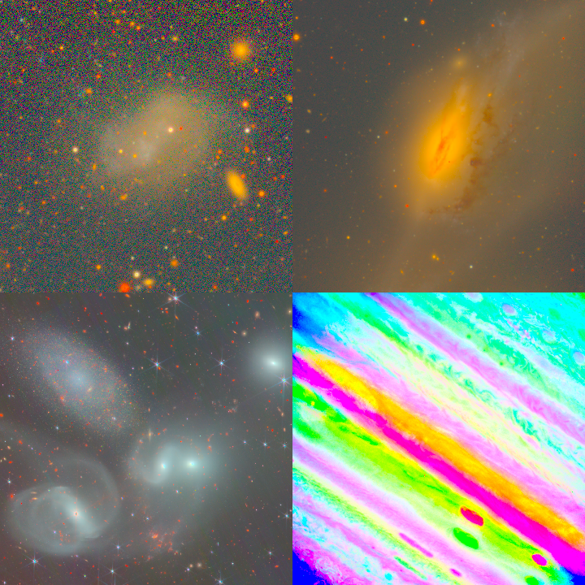
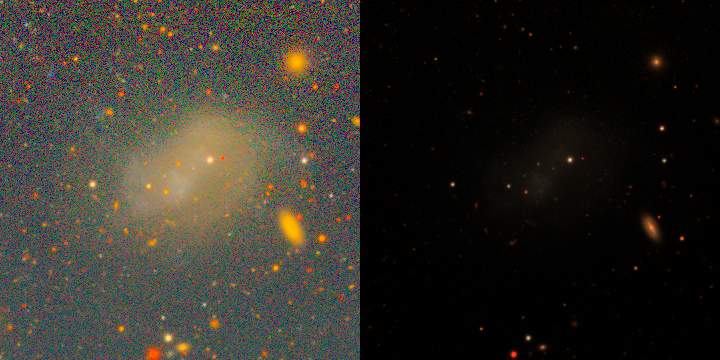

# Astronomical Transform Gallery

Visual demonstrations of contrast stretches, background estimation, normalizations, multi-band RGB synthesis, and tabular sigma-clipping transforms provided by `torchfits.transforms`.

For class signatures and parameter definitions, see the [Transforms API Reference](api-transforms.md).

---

## 1. Compound Astronomical Imaging Pipelines (`Compose`)

Raw astronomical imaging spans wide dynamic ranges (from faint diffuse emission at the sky noise floor to saturated stellar cores). A standard pipeline chains background subtraction, non-linear contrast stretching, and dynamic range normalization:

```python
import torchfits
from torchfits.transforms import (
    ArcsinhStretch,
    BackgroundSubtract,
    Compose,
    ZScaleNormalize,
)

# Read raw FITS image
image = torchfits.read_tensor("horsehead.fits", hdu=0).float()

# Chain background estimation, arcsinh contrast expansion, and IRAF-style ZScale
pipeline = Compose(
    [
        BackgroundSubtract(),
        ArcsinhStretch(a=0.1),
        ZScaleNormalize(),
    ]
)

# Process image tensor
processed = pipeline(image)

# Invert transform if needed
restored = pipeline.inverse(processed)
```


Corresponding script: [`example_transforms.py`](published-examples/example_transforms.py).

---

## 2. Multi-Band Color Synthesis

Astronomical color images combine filter exposures into RGB. Two mappings ship in
`torchfits.transforms`:

- **`rgb`** — auto stretch, 1–7 bands, shortest wavelength first (`rgb(g, r, i)`).
- **`lupton_rgb`** — Astropy-parity Lupton asinh, reddest first (`lupton_rgb(r=i, g=r, b=g)`).

```python
import torchfits
from torchfits.transforms import rgb

g = torchfits.read_tensor("sdss_g.fits", hdu=0)
r = torchfits.read_tensor("sdss_r.fits", hdu=0)
i = torchfits.read_tensor("sdss_i.fits", hdu=0)

# Pretty default: MAD auto-scale, coupled asinh, sRGB
rgb_tensor = rgb(g, r, i)
print(f"Generated RGB tensor with shape: {rgb_tensor.shape}")  # [H, W, 3]
```



Same stretch, four skies: [`example_rgb_sky.py`](published-examples/example_rgb_sky.py).
Why auto instead of library-default Lupton on a faint tail:



HSC PDR3 files you already have use the same call: `rgb(g, r, i, z, y)`.
Nanomaggy or MJy/sr cubes pass `calibrated=True` (or `zeropoints=` for AB of 1 count).

### Lupton asinh (`lupton_rgb`)

The Lupton (2004) algorithm preserves color ratios across faint and bright regions
while preventing saturation burn-out in stellar cores. Argument order is reddest first:

```python
import torchfits
from torchfits.transforms import lupton_rgb

# Load aligned filter bands (e.g. SDSS i, r, g)
i_band = torchfits.read_tensor("sdss_i.fits", hdu=0)
r_band = torchfits.read_tensor("sdss_r.fits", hdu=0)
g_band = torchfits.read_tensor("sdss_g.fits", hdu=0)

# Map reddest filter (i) to Red, middle (r) to Green, bluest (g) to Blue
rgb_tensor = lupton_rgb(
    r=i_band,
    g=r_band,
    b=g_band,
    Q=8.0,
    stretch=0.15,
)
print(f"Generated RGB tensor with shape: {rgb_tensor.shape}")  # [H, W, 3]
```


Corresponding script: [`example_lupton_rgb_sdss.py`](published-examples/example_lupton_rgb_sdss.py).

---

## 3. Time-Series & Light Curve Outlier Rejection

Photometric time series often contain non-Gaussian outliers caused by cosmic rays, satellite trails, flares, or instrumental glitches. The `torchfits.transforms` module provides symmetric and asymmetric sigma-clipping:

```python
import torch
from torchfits.transforms import AsymmetricSigmaClip, SigmaClip

# Sample photometric flux series
flux = torch.randn(100, dtype=torch.float32)

# Symmetric rejection for 1D series (dim=(-1,))
clipped_symmetric = SigmaClip(n_sigma=3.0, dim=(-1,))(flux)

# Asymmetric rejection (e.g. strict lower clipping for dips, relaxed upper clipping for flares)
clipped_asymmetric = AsymmetricSigmaClip(n_low=2.5, n_high=5.0, dim=(-1,))(flux)
```

### Symmetric Sigma Clipping


### Asymmetric Sigma Clipping (Flare / Transit isolation)


Corresponding script: [`example_time_series.py`](published-examples/example_time_series.py).

---

## 4. FITS Header-Driven Linear Calibration

When FITS tables or arrays encode physical quantities using standard `BSCALE` and `BZERO` keywords ($y = \text{BZERO} + x \times \text{BSCALE}$):

```python
import torch
from torchfits.transforms import FITSHeaderScale

# Linear scaling transform from BSCALE and BZERO
scaler = FITSHeaderScale(bscale=0.0036, bzero=32768.0)
raw_counts = torch.tensor([100.0, 200.0, 300.0], dtype=torch.float32)
physical_flux = scaler(raw_counts)
```


---

## 5. Building Custom Transforms

You can create custom transforms by subclassing `FITSTransform`. This integrates directly into `Compose`, PyTorch `Dataset` classes, and GPU training pipelines:

```python
import torch
from torchfits.transforms import Compose, FITSTransform, ZScaleNormalize


class SkyNoiseInjector(FITSTransform):
    """Add synthetic Gaussian sky noise for data augmentation."""

    def __init__(self, std: float = 0.05):
        super().__init__()
        self.std = std

    def forward(
        self, tensor: torch.Tensor, mask: torch.Tensor | None = None
    ) -> torch.Tensor:
        noise = torch.randn_like(tensor) * self.std
        return tensor + noise


# Chain custom transform in a pipeline
aug_pipeline = Compose(
    [
        SkyNoiseInjector(std=0.02),
        ZScaleNormalize(),
    ]
)
```

Corresponding script: [`example_custom_transform.py`](published-examples/example_custom_transform.py).
