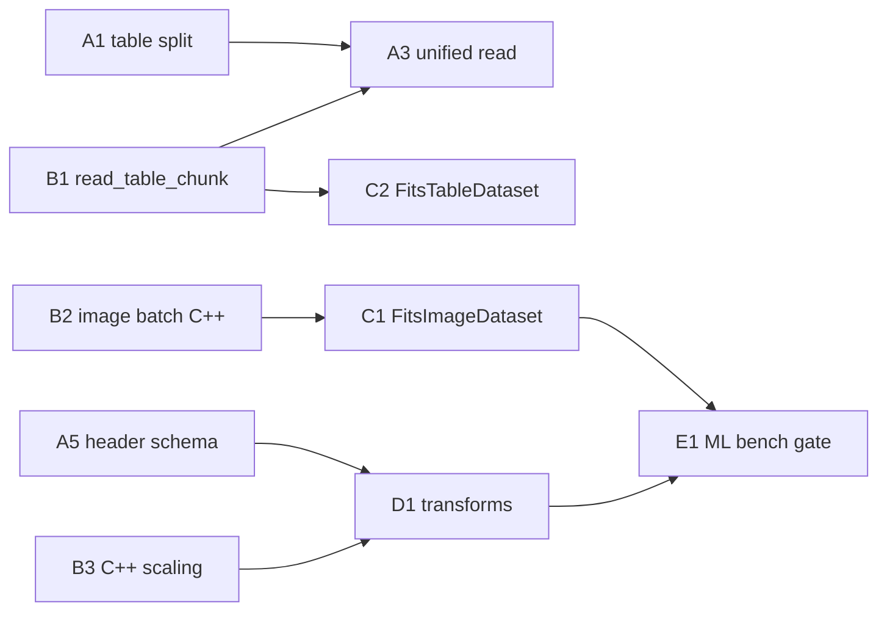

# Roadmap

`torchfits` is a focused FITS I/O package for PyTorch. The roadmap is organized
around an explicit compatibility contract rather than broad claims of full
Astropy, fitsio, or CFITSIO replacement.

## Parity tiers

| Tier | Target | Meaning |
|---|---|---|
| 0 | Public contract | README, API docs, examples, and release notes describe only the implemented FITS I/O surface. |
| 1 | fitsio core workflows | Common image/table/header/checksum/compression workflows interoperate with `fitsio`. |
| 2 | Astropy common workflows | Common `astropy.io.fits` HDU, header, image, compressed-image, and table workflows interoperate with torchfits. |
| 3 | Selected CFITSIO behavior | Native backend behavior is documented where torchfits intentionally exposes CFITSIO-backed semantics. |
| 4 | Explicit non-goals | Full CFITSIO API parity, WCS solving/modeling, sphere geometry, HEALPix, and sky-domain simulation are outside torchfits. |

## Near-term work

- Treat parity as a tested compatibility surface, not a blanket claim that
  torchfits reimplements Astropy, fitsio, or the CFITSIO C API.
- Keep the package boundary clean: torchfits owns FITS I/O only; sky-domain
  tensor models and simulation workflows stay outside this repository.
- Expand parity smoke tests for `fitsio` and `astropy.io.fits` whenever a public
  claim is added to `docs/parity.md`.
- Keep unsupported mmap behavior explicit for VLA and scaled table columns.
- Keep benchmark evidence scoped to FITS images and FITS tables, with separate
  rows for mmap fairness, compression, scaling, and table pushdown.
- Maintain release gates that scan docs for stale WCS/sphere/HEALPix ownership
  claims.

### Permanent design decisions (not gaps)

These Partial items are inherent format limitations or deliberate architectural
choices, not work items to be closed:

- **VLA mmap reads/updates** — Variable-length arrays use a separate heap with
  pointer indirection; flat `mmap` cannot stride across variable-length records.
  The buffered CFITSIO path is the correct solution.
- **Scaled column mmap updates** — Reverse-scaling arithmetic risks precision
  loss and overflow when writing floats back through integer storage. Unsafe by
  design.
- **GPU writes** — The CFITSIO C API requires host `void*` pointers. Bypassing
  it requires CUDA kernels or GPUDirect Storage, massive engineering for
  marginal gain. Host-copy is intentional.
- **Arrow/Pandas/Polars/DuckDB interop as optional** — Keeping these as optional
  dependencies preserves PyTorch's lightweight package boundaries.

## Longer-term candidates

- Broaden Astropy table parity where it is useful for FITS users: additional
  header/card round-trips, richer ASCII table schemas, and more variable-length
  array cases.
- Improve compressed-image write coverage beyond the current supported tensor
  image payloads, while keeping unsupported compressed table/dict payload cases
  explicit.
- Add benchmark replay snapshots for representative public FITS files so
  performance claims are tied to reproducible inputs.
- Consider additional CFITSIO-backed capabilities only when they can be exposed
  through a small PyTorch-native API and covered by tests.

## 0.6.0 — maintainable core + ML-native FITS pipelines

**Vision:** 0.5.0 proved torchfits can beat astropy/fitsio on FITS I/O. 0.6.0 makes that
speed *usable* in real training and inference loops: a maintainable Python/C++ core,
first-class `torch.utils.data` integration, and header-aware preprocessing so users
stop re-implementing BSCALE/BZERO/TSCAL/TZERO glue in every project.

0.6.0 is still **FITS I/O**, not sky-domain modelling. WCS solving, HEALPix, sphere
geometry, and simulation pipelines remain out of scope. Datasets and normalization here
mean **FITS bytes → correctly scaled tensors → DataLoader**, not astronomy application
frameworks.

### Track A — Python core decomposition *(from thermo-nuclear audit)*

Goal: no hot-path module past ~1k lines; one schema parser; one table read pipeline.

| Priority | Work | Exit criteria |
|---|---|---|
| A1 | Split `table.py` into `_table/` (`schema`, `arrow_convert`, `read`, `where`, `mutate`, `interop`) | Public `torchfits.table` unchanged; each file ≤ ~600 lines |
| A2 | Refactor `read_dispatch.read_unified` → `ReadDeps` + strategy list | Dispatcher ≤ ~150 lines; no `recursive_read` closure |
| A3 | Unify table read surfaces (Arrow + tensor share one C++ reader layer) | Documented in `docs/api.md`; zero duplicate TFORM walks outside `fits_schema` |
| A4 | Replace `TableHDU.__init__` coercion soup with `fits_schema`-driven `_coerce_column` | Unknown column kinds fail loudly; no silent `continue` drops |
| A5 | Header-only `table.schema()` fast path (TFORM → Arrow types, no row read) | `schema()` ≤1 header pass when `where=None` |

**Presumptive blockers if deferred:** any new table feature landing in monolithic `table.py`;
`read_dispatch.py` growing past 1.2k lines without strategy refactor.

### Track B — C++ engine *(ambitious, high leverage)*

Goal: one canonical read API per domain; worker-safe batching; less Python feature-probing.

| Priority | Work | Why |
|---|---|---|
| B1 | **`read_table_chunk(path, hdu, cols, row_spec, mmap)`** — replaces the 7-deep Python fallback chain in `_read_cpp_numpy_table` | Deletes hundreds of lines of `hasattr(cpp, …)` spaghetti; single place to optimize |
| B2 | **`read_images_batch(paths, hdu, …)`** — vectorized multi-file image decode with shared handle pool | Powers DataLoader workers + `read_batch` without per-item Python overhead |
| B3 | **Consolidated scaling in C++** — apply BSCALE/BZERO (images) and TSCAL/TZERO (tables) in one layer with `scale_on_device` policy | Same semantics across `read`, `read_tensor`, table paths, and future datasets |
| B4 | **Table pushdown v2** — extend `read_fits_table_filtered` for VLA-safe projections, `IN` lists, and compound predicates where mmap-safe | Closes gap where Python falls back to read-then-filter on large catalogs |
| B5 | **Worker-local handle affinity** — optional `TORCHFITS_WORKER_HANDLE=1` so forked DataLoader workers don't fight a global LRU | Documented pattern for `num_workers > 0` without stale-handle bugs |
| B6 | **Pinned host buffer pool** *(stretch)* — reuse pinned CPU staging for CUDA `read_tensor` | Cuts H2D alloc churn in tight training loops; benchmarked in `bench_ml_loader` |

**Exit criteria:** one Python call site per table chunk read; `bench_ml_loader` rows merged
into `docs/benchmarks.md`; no regression on upstream parity gates.

### Track C — `torchfits.data`: datasets & dataloaders *(new public surface)*

Goal: ship what every example currently hand-rolls — a thin, fast, documented data layer.

Today: `examples/example_image_dataset.py` and `benchmarks/bench_ml_loader.py` define ad-hoc
`Dataset` classes. `torchfits.table.dataset` wraps PyArrow only. Cache tuning exists
(`optimize_for_dataset`) but isn't wired into loaders.

Proposed module: **`torchfits.data`** (lazy-imported like `torchfits.table`).

| Component | Behavior |
|---|---|
| `FitsImageDataset` | File list or glob; lazy `read_tensor`; optional label from header keys; `read_batch` collate path for inference |
| `FitsImageIterableDataset` | Sharded file list for multi-worker; deterministic split by rank/world_size |
| `FitsTableDataset` | Row-indexable catalog: projection + `where=` pushdown; columns → tensor dict per `__getitem__` |
| `FitsTableIterableDataset` | Wraps `table.scan` / C++ chunk iterator; constant-memory epoch over 100M+ rows |
| `FitsCutoutDataset` | `(path, x, y, w, h)` index table + `open_subset_reader` for patch training |
| `fits_collate_fn` | Stack homogeneous tensors; explicit error on ragged/VLA unless `vla_policy=` set |
| `DataLoader` helpers | `make_loader(dataset, *, pin_memory, prefetch, cache_policy=…)` applying `cache.optimize_for_dataset` |

Design rules:

- **No hidden global state in workers** — each worker gets handle policy from env or explicit `worker_init_fn`.
- **Device policy is explicit** — `device="cpu"` default; CUDA reads document host-decode + H2D (same honesty as benchmarks).
- **Composable with Track D** — datasets accept optional `transform=` callable.

**Exit criteria:** replace `example_image_dataset.py` with `torchfits.data` imports;
new tests for multi-worker smoke (spawn/fork), sharded iterable, table scan epoch;
`docs/examples.md` + `docs/api.md` sections for data loading.

### Track D — preprocessing & normalization *(FITS-native transforms)*

Goal: header keywords become a typed transform pipeline, not copy-pasted arithmetic.

| Priority | Work | Details |
|---|---|---|
| D1 | **`torchfits.transforms` module** | `Compose`, `FitsScaleImage` (BSCALE/BZERO), `FitsScaleColumns` (TSCAL/TZERO/TNULL), `CastDtype`, `Clamp`, `PerChannelStats` |
| D2 | **Schema-aware table null handling** | Apply TNULL → NaN/mask consistently in tensor and Arrow paths via `fits_schema` |
| D3 | **Unsigned integer policy object** | Single `UnsignedConvention` used by read, write, transforms (replaces scattered TZERO heuristics) |
| D4 | **Recipe helpers** | `normalize_image(data, header)` and `denormalize_for_write(data, header)` round-trip for scaled integer images |
| D5 | **Optional photometry hooks** *(not WCS)* | Read `BUNIT` / `TUNIT` / custom header keys into transform metadata; no unit conversion library required |
| D6 | **Table column stats cache** | One-pass or streaming mean/std for normalization — backed by `scan` not full materialize |

Explicit **non-goals** for Track D: PSF models, astrometric distortion, background
estimation algorithms, or sky subtraction physics — those belong in downstream packages.
torchfits supplies **correct, tested scale/null/dtype semantics** from FITS headers.

**Exit criteria:** scaled-image and scaled-table upstream smokes pass through transform
round-trip; docs show before/after for a typical ML preprocessing chain.

### Track E — evidence & developer experience

| Item | Action |
|---|---|
| ML benchmarks | Promote `bench_ml_loader.py` from diagnostic → release gate subset |
| GPU memory | Keep `bench_gpu_memory.py` as leak/regression guard for dataset + cache paths |
| Replay fixtures | Add public-catalog replay entries in `benchmarks/replays/upstream_sources.json` for dataloader cases |
| Migration guide | `docs/changelog.md` section: 0.5.x custom Dataset → 0.6 `torchfits.data` |
| Agent/CI ergonomics | `pixi run release-gate` covers data module smoke once shipped |

### Suggested sequencing

**Phase 1 (foundation):** A1, A2, B1, B3 — maintainability + one C++ read path + scaling clarity.  
**Phase 2 (ML surface):** C1–C4, B2, B5 — datasets that win on `bench_ml_loader`.  
**Phase 3 (polish):** D1–D4, B4, A4, A5 — transforms + pushdown + schema fast path.  
**Phase 4 (evidence):** E + B6 if benchmarks justify pinned pools.

### Out of scope for 0.6.0

- Full CFITSIO C API exposure
- GPU FITS writes or true disk→GPU bypass (GPUDirect/cuFile)
- WCS, HEALPix, sphere geometry, simulation/training orchestration frameworks
- Mandatory PyArrow/Polars/Pandas dependencies on the core package
- Replacing Astropy/fitsio for metadata editing workflows unrelated to tensor I/O

### 0.6.0 release gate *(extends 0.5.0)*

In addition to the standard release gate:

- [ ] `_table/` split complete; `table.py` is re-exports only (≤ ~200 lines)
- [ ] `read_unified` strategy refactor merged; `read_dispatch.py` ≤ ~800 lines
- [ ] C++ `read_table_chunk` is the sole Python table-chunk entry
- [ ] `torchfits.data` documented with multi-worker test coverage
- [ ] `torchfits.transforms` round-trip tests for scaled images and tables
- [ ] `bench_ml_loader` median throughput documented vs fitsio baseline (same hardware)
- [ ] No parity regression on existing upstream smoke gates

### Legacy note — 0.5.0 quick wins *(done)*

Shared `fits_schema`, where-read policy, `_table/cache`, non-recursive `table.read`,
and cache invalidation decoupled from `io ↔ table` imports shipped in 0.5.0b3–b4.

### 0.5.0 performance closure *(done in 0.5.0b4+)*

High-priority benchmark gaps addressed before the 0.5.0 tag:

| Item | Status | Notes |
|---|---|---|
| GPU unsigned uint16/uint32 without int64 CPU widen | **Done** | H2D narrow dtype; offset on device (`_apply_scale_on_device`) |
| GPU signed-byte int8 without float32 promotion | **Done** | BZERO=-128 convention → int8 on device |
| Honest integer GPU benchmark docs | **Done** | `docs/benchmarks.md` dtype-fair section; README ML + integer notes |
| Dtype-fair GPU bench column | **Done** | `torchfits_dtype_fair_device` in `bench_gpu_transports.py` |
| Training cache warm-up docs | **Done** | `optimize_for_dataset` in `example_image_dataset.py` |
| ML loader diagnostic in release notes | **Done** | README + changelog cite `bench_ml_loader.py` CPU numbers |
| Lab CUDA snapshot refresh | **Done** | `exhaustive_mmap_0.5.0b4_20260630_162835` — 3626 rows, **13 deficits** (was 22) |

**Deferred to 0.6.0** (medium/low priority from perf triage):

| Item | Track |
|---|---|
| MEF / multi-HDU handle pooling | B2, B5 |
| Promote `bench_ml_loader` to release gate | E |
| Marginal CUDA cases (hcompress, tiny int8, repeated cutouts <5%) | B3/B6 if profiling finds wins |
| Pinned host buffer pool for CUDA H2D | B6 |
| Table GPU transports | Out of scope |

## Release gate

A release may claim parity only for rows that have one of:

- a passing test listed in `benchmarks/replays/upstream_sources.json`;
- a benchmark row in the FITS or FITS-table benchmark suites;
- an explicit unsupported or out-of-scope entry in `docs/parity.md`.
